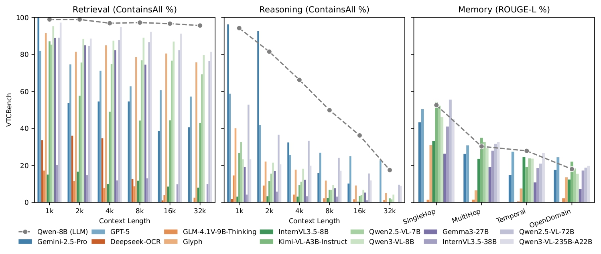

# VTCBench: Can Vision-Language Models Understand Long Contexts with Vision-Text Compression?

  
  
  
  

VTCBench is the first comprehensive benchmark specifically designed to evaluate
the long-context understanding capabilities of Vision-Language Models (VLMs) 
within the Vision-Text Compression (VTC) paradigm.

  
  

VTC is an emerging framework that converts long texts into dense 2D visual 
representations (images), achieving token compression ratios of 2-10x 
compared to standard text tokenization. VTCBench rigorously assesses whether 
VLMs can actually understand this compressed information or if they are merely
performing surface-level OCR.

## 🚀 Key Features

- **Three Core Tasks**: Evaluates VLMs across Retrieval, Reasoning, and Memory.
- **VTCBench-Wild**: A variant designed to simulate real-world visual diversity 
  (e.g., varying fonts, backgrounds, and layouts)
- **Two Evaluation Settings**: 
  - Predefined VTC Ratio: Predetermines the compression ratio (e.g., $r_\texttt{VTC}=2.0$)
    to compare model intelligence at a standardized information density
  - Predefined Rendering: Uses a fixed document format (12-pt Helvetica, 96 DPI) 
    to simulate realistic document processing666.
- **Extensive Model Coverage**: Benchmarks 13 leading models including GPT-5, 
  Gemini-2.5 Pro, Gemma, Glyph, Qwen2.5 & Qwen3 & InternVL3.5 series, and more.

## 📊 Benchmark Tasks

<table>
<tr>
<th>Task</th>
<th>Task Categories</th>
<th>Task Description</th>
<th>Context Example</th>
<th>Evaluation Example</th>
<th>Visual Text Example</th>
</tr>

<tr>
<td>VTC-Retrieval (NIAH)</td>
<td>Lexical Matching, Multi-Hop Tracing, Aggregation</td>
<td>
  A visual "Needle-In-A-Haystack" (NIAH) test. Requires locating specific 
  "needles" (key-value pairs) embedded within a large "haystack" of distractors.
  
Sub-tasks: Single-needle, Multi-keys, Multi-values, and Multi-queries.

</td>
<td>
  (Dynamic 
  query/key-value 
  with types: 
  word-word,
  word-number, 
  uuid-number)
  
(essays...)

  One of the special magic numbers for 
  long-context is: 
  2026.
  
...One of the special magic numbers for distracting-information is: 2025.

</td>
<td>
  
<b>QA Variant:</b>

  <i>Q:</i> What's the special magic number for long-context?
  <i>A:</i> 2026.
  
<b>Completion Variant:</b>

  <i>Prompt:</i> one of the special magic number for long-context is:
  <i>Completion:</i> 2026.
</td>
<td></td>
</tr>

<tr>
<td>VTC-Reasoning  (NIAH)</td>
<td>Associative Reasoning, Question-Answering</td>
<td>
  Minimized literal overlap between query and key. 
  Requires inferring latent associations rather than simple keyword matching.
</td>
<td>
  (Dynamic 
  query/key-value 
  with types: 
  event/action-person)
  
(books...)

  There was a vegan guest, named Katie.
</td>
<td>
  
<b>One-Hop Reasoning:</b>

  <i>Q:</i> Which character cannot eat fish-based meals?
  <i>A:</i> Katie.
  
<b>Two-Hop Reasoning:</b>

  <i>Q:</i> Which character cannot eat Brandade meals?
  <i>A:</i> Katie.
</td>
<td></td>
</tr>

<tr>
<td>VTC-Memory (QA)</td>
<td>Memory, Question-Answering</td>
<td>
  Multi-turn conversations testing long-term memory.
  
Sub-tasks: Single-hop, Multi-hop, Temporal reasoning, and Open-domain knowledge.

</td>
<td>
  (No dynamic 
  query/key-value,
  fully static.)
  
(conversations...)

  <i style='color: orange'>Caroline</i>: Researching adoption agencies&mdash;it's
  been a dream to have a family and give a loving home to kids who need it.
</td>
<td>
  <i>Q:</i> What did Caroline research?
  <i>A:</i> Adoption agencies.
</td>
<td></td>
</tr>

</table>

### VTCBench-Wild

A more challenging variant of the above tasks, introducing visual noise and 
diversity to simulate real-world document conditions.

## 📈 Main Findings

- **Perception $\neq$ Comprehension**: While many VLMs excel at OCR and simple 
  retrieval, their performance collapses on reasoning and memory tasks 
  compared to text-only LLMs.
- **Length Fragility**: VLM performance degrades significantly as the context 
  length increases (e.g., from 1k up to 32k tokens).
- **Parameter Sensitivity**: VTC performance is highly sensitive to font size 
  and the spatial positioning of information

## 🛠 Usage & Data

Please refer to the [Usage Guide](docs/USAGE.md) for instructions on how to use VTCBench.
